  

## Hakkımda

Kurumsal ağ, güvenlik duvarı ve sistem operasyonlarında görev alan bir **Network Specialist** olarak çalışıyorum.

Marka bağımsız ağ ve güvenlik duvarı operasyonlarında; müşteri taleplerinin değerlendirilmesi, değişiklik öncesi analiz, uygulama, erişim doğrulama ve log kontrolleri üzerine çalışıyorum. FortiGate ortamlarında **policy, address/service object, NAT, VPN, routing ve VLAN** operasyonlarını ekip, onay ve değişiklik yönetimi süreçleri kapsamında yürütüyorum.

Erişim problemlerini **IP adresleme, subnet, gateway, DNS, routing, hedef port, policy ve log verileri** üzerinden analiz ederek sorunun ağ, güvenlik duvarı veya hedef sistem katmanından kaynaklanıp kaynaklanmadığını ayrıştırıyorum.

Operasyonel süreçlerde **PowerShell, C# ve .NET Web API** deneyimimi otomasyon, entegrasyon, loglama, audit ve teknik sorun çözme süreçlerinde kullanıyorum.

---

## 🛡️ Profesyonel Odak

  
  
  
  
  
  

Odağım yalnızca cihaz konfigürasyonu yapmak değil; **değişiklik öncesi analiz → uygulama → erişim doğrulama → log kontrolü → gerektiğinde rollback** zincirini uçtan uca değerlendirmektir.

---

## 🌐 Network & Firewall

  
  

Firewall operasyonlarında policy ve object yönetimi, NAT/VPN işlemleri, routing/switching kontrolleri, VLAN yapıları ve log incelemeleriyle çalışıyorum. Ağ erişim problemlerinde kaynak ve hedef IP, subnet, gateway, route, DNS, hedef port, servis durumu ve firewall akışını birlikte değerlendiriyorum.

---

## ⚙️ Automation & Backend

  
  
  
  
  

Network ve sistem operasyonlarında tekrar eden işlemlerin otomasyonu, backend servisleri, entegrasyon, yetkilendirme, loglama ve audit süreçleri üzerinde çalışıyorum.

---

## 🖥️ Destekleyici Sistem Deneyimi

  
  
  
  

Bu teknolojileri ana uzmanlık unvanım olarak değil; network operasyonlarını destekleyen **sistem, servis ve entegrasyon deneyimim** kapsamında kullanıyorum.

---

## 🏢 Operasyon & Datacenter

  
  
  
  

Cihaz kurulumu ve değişimi, rack yerleşimi, kablolama, etiketleme, fiziksel bağlantı doğrulama, konfigürasyon yedeği, değişiklik kaydı ve rollback planı gibi operasyonel süreçlerde görev alıyorum.

---

## 🧪 Security Lab & Analysis

  
  
  
  

T-Pot honeypot ortamında ağ güvenliği testleri, Nmap taramaları, kontrollü saldırı senaryoları, SpiderFoot araştırmaları ve Kibana üzerinden log analizleri gerçekleştirdim.

---

  <b>Network Specialist</b> 
  Network & Firewall Operations · Troubleshooting · Systems · Automation

